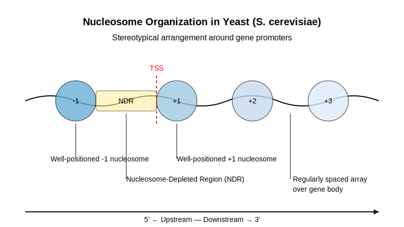

```{css sidenote, echo = FALSE}

.main-container {
    margin-left: 250px;
}
.sidenote, .marginnote { 
  float: right;
  clear: right;
  margin-right: -40%;
  width: 37%;         # best between 50% and 60%
  margin-top: 0;
  margin-bottom: 0;
  font-size: 1.1rem;
  line-height: 1.3;
  vertical-align: baseline;
  position: relative;
  }
```


<style>
@import url('https://fonts.googleapis.com/css?family=Raleway');
@import url('https://fonts.googleapis.com/css?family=Oxygen');
@import url('https://fonts.googleapis.com/css?family=Raleway:bold');
@import url('https://fonts.googleapis.com/css?family=Oxygen:bold');

.main-container {
  max-width: 1400px !important;
}

body{
  font-family: 'Oxygen', sans-serif;
  font-size: 16px;
  line-height: 24px;
}

h1,h2,h3,h4 {
  font-family: 'Raleway', sans-serif;
}

.container { width: 1400px; }

caption {
  font-size: 20px;
  caption-side: top;
  text-indent: 30px;
  background-color: lightgrey;
  color: black;
  margin-top: 5px;
}

g-table-intro h4 {
  text-indent: 0px;
}
</style>

```{r setup, include = FALSE}
knitr::opts_chunk$set(echo = TRUE,
                      comment = NA,
                      warning = FALSE,
                      error = FALSE,
                      message = FALSE,
                      cache = FALSE,
                      fig.width = 8,
                      fig.height = 4)
```

```{r gn4gd-GlobalOptions, results="hide", include=FALSE, cache=FALSE}

knitr::opts_knit$set(stop_on_error = 2L) #really make it stop
options(knitr.table.format = 'html')

options(stringsAsFactors=F)

 #knitr::dep_auto()

```
<!-- ######################################################################## -->


```{r gn4gd-Prelims,  include=FALSE, echo=FALSE, results='hide', message=FALSE} 


FN <- "_GN4GD_analysis"
if(sum(grepl(FN, list.files()))==0) stop("Check FN")

PREFIX <-  FN

 suppressMessages(require(rmarkdown))
 suppressMessages(require(knitr))

 suppressPackageStartupMessages(require(methods))
 suppressPackageStartupMessages(require(bookdown))

 suppressPackageStartupMessages(require(magrittr))

 # Shotcuts for knitting and rendering while in R session (Invoke interactive R from R/Scripts folder)
 kk <- function(n='') knitr::knit2html(paste("t", n, sep=''), envir=globalenv(),
       output=paste(FN,".html", sep=''))

 rr <- function(n='') rmarkdown::render(paste("t", n, sep=''), envir=globalenv(),
       output_file=paste(FN,".html", sep='')) ##, output_dir='Scripts')
 bb <- function(n='') browseURL(paste(FN,".html", sep='')) 
 # Theual shortcuts 
 zz <- function(n='') source(paste("t", n, sep='')) 

 # file rmarkdown file management options: cache, figures
 cache_DIR <- paste0(PREFIX, '_cache/')
 suppressMessages(dir.create(cache_DIR, recursive=T))
 opts_chunk$set(cache.path=cache_DIR)

 # NOTE: need to add PREFIX to figure path
 # due to confluence "feature" of keeping the filename of embedded figures

 figure_DIR <- paste(PREFIX, '_figures')
 suppressPackageStartupMessages(dir.create(figure_DIR, recursive=T))
 opts_chunk$set(fig.path=paste0(figure_DIR, PREFIX))


``` 

```{r gn4gd-load-packages,  include=FALSE, echo=FALSE, results='hide', message=FALSE, cache=T}1

# Load required packages
if (!requireNamespace("BiocManager", quietly = TRUE))
  install.packages("BiocManager")

# Install required packages if not already installed
required_packages <- c("limma", "p/reprocessCore", "ArrayExpress", "GenomicRanges",
                       "ggplot2", "rtracklayer", "Biostrings", "BSgenome.Scerevisiae.UCSC.sacCer3")
for (pkg in required_packages) {
  if (!requireNamespace(pkg, quietly = TRUE))
    BiocManager::install(pkg)
}

# Load required packages
library(limma)
library(preprocessCore)
library(ArrayExpress)
library(GenomicRanges)
library(ggplot2)
library(rtracklayer)
library(Biostrings)
library(BSgenome.Scerevisiae.UCSC.sacCer3)

```

<!-- ######################################################################## -->

<br/>

* We are interested in learning about the preprocessing step referred to as 
normalization in **Group Normalization for Genomic Data**, Ghandi and Beer 2012 [@Ghandi:2012aa]^[

* David 2006 [@David:2006] and Huber 2006 [@Huber:2006aa] offer an alternative  procedurure and provide data
and software to assess performance.


<br/>

# Introduction {.tabset}


## Home {-}

<br/>

## Nucleosome Biology { .tabset}

### Home {-}

<br/>

### What are Nucleosomes? {-}

* Nucleosomes are the fundamental unit of chromatin structure in eukaryotic cells. 

* Each nucleosome consists of approximately 147 base pairs of DNA wrapped around 
an octamer of histone proteins (two copies each of H2A, H2B, H3, and H4). 

* Nucleosomes are connected by "linker DNA" of variable length (typically 10-80 bp), creating a "beads-on-a-string" structure that represents the first level of DNA packaging in the nucleus.


<br/>

### Why are they Important {-}

Nucleosomes play critical roles in genome function:

* **Genome Accessibility**: Nucleosomes restrict access to the DNA they wrap, acting physical barriers to DNA-binding proteins. This affects all DNA-dependent processes including transcription, replication, and repair.

* **Transcriptional Regulation**: Nucleosome positioning at promoters and regulatory elements can determine whether transcription factors can access their binding sites, directly impacting gene expression.

* **Epigenetic Regulation**: Histone modifications on nucleosomes serve signals for recruiting chromatin-modifying enzymes and transcription factors.


<br/>

### Positioning Patterns {-}

Nucleosomes are not randomly distributed along the genome but show specific positioning patterns:

* **Nucleosome-Depleted Regions (NDRs)**: Typically found at active promoters, enhancers, and transcription termination sites. These regions allow transcription factors and the transcription machinery to access DNA.

* **Well-Positioned Nucleosomes**: The +1 nucleosome (immediately downstream of the transcription start site) and -1 nucleosome (upstream of the promoter) are often precisely positioned.

* **Phased Arrays**: Downstream of the +1 nucleosome, subsequent nucleosomes often form regular arrays with consistent spacing.

* **Sequence Preferences**: DNA sequence composition influences nucleosome formation, with some sequences (like poly(dA:dT) tracts) disfavoring nucleosome formation.


<br/>

### yeast  {-}

* In yeast (*Saccharomyces cerevisiae*), a stereotypical nucleosome organization
exists around gene promoters: 
  - a nucleosome-depleted region (NDR) upstream of the transcription start site (TSS)
  - flanked by well-positioned -1 and +1 nucleosomes
  - followed by an array of regularly spaced nucleosomes over the gene body.

```{r gn4gd-yeast-oorg, title="Nucleosome Organization in Yeast (S. cerevisiae)", echo=F}

   

```

## David and Huber - Biology {.tabset}

### Home {-}

<br/>

## Study Design { .tabset}


### Home {-}


<br/>

### Assay Design {-}


* **Experimental Assay (MNase-chip)**:
   - **Crosslinking**: Cells are treated with formaldehyde to crosslink DNA to histones, preserving nucleosome positions
   - **Nuclease Digestion**: Micrococcal nuclease (MNase) preferentially digests linker DNA between nucleosomes, leaving nucleosome-protected DNA intact
   - **DNA Isolation**: Nucleosome-protected DNA fragments (~147 bp) are purified
   - **Labeling and Hybridization**: The DNA labeled and hybridized to the tiling array


/
<br/>

### Tiling Array Design {-}


* High-density oligonucleotide microarrays with probes spaced at regular intervals across the genome
* For yeast studies like Lee et al. (2007) [@Lee:2007aa] Affymetrix arrays witr 
   - ~2.6 million 25-bp oligonucleotide probes covering the entire yeast genome 

* Each probe measures the abundance of DNA fragments that hybridize to it
   - includes  targeted  fragments which have the complementary sequence, and
other fragments    
   - each probe is different in terms of its response to the mix of on-target
and off-target fragments in the hybridized samples.
      - See Figure 1 from paper

<!--
* probe response  heterogeneity complicates the analysis needed to determine if two
samples differ in the amounts of targeted fragments.
   - group normalization is intended 
-->

<br/>

### Figure 1 {-}

```{r}
CAPTION <- readLines("_GN4GD_analysis_figures/Fig001.txt", warn=F)
CAPTION <- paste(CAPTION, 
"^[A better representation of reproducibility is provided by the
[Bland–Altman plot](https://en.wikipedia.org/wiki/Bland%E2%80%93Altman_plot) or
[MA plot](https://en.wikipedia.org/wiki/MA_plot).
]")
```


 <style>
    p.caption {
      font-size: 0.9em; /* Adjust font size relative to default */
      line-height: 1.2; /* Adjust line spacing */
      max-width: 600px; /* Limit caption width to prevent overly long lines */
      word-wrap: break-word; /* Allow long words to break */
    }
    </style>


```{r gn4gd-fig1, fig.cap=CAPTION}

knitr::include_graphics("_GN4GD_analysis_figures/Fig001.png", dpi=200)

```


<br/>

### Experimental Design {-} 

<p><p/>
* A typical nucleosome positioning experimenting tiling arrays might include:

   -  **Test samples**: samples bearing thee condition to be tested e.g., mutant strains, different growth conditions
   -  **Reference Samples**: Genomic DNA samples to adjust or account for probe-specific effects
   -  **Biological Replicates**: Multiple independent biological samples to assess reproducibility
   -  **Controls**: Defined nucleosome with known attributes which can function as
positive and negative controls.  (e.g., +1 nucleosomes at well-studied genes)


<br/>


# Implementation Details {.tabset}

## Home {-}

<br/>

## Workflow {-}

<p><p/>
* **Raw Data Examination and QC** 
   - Probe intensity values across the genome
   - Substantial probe-to-probe variation due to sequence-specific hybridization differences
   - Biological signal (nucleosome occupancy) superimposed on these technical variations


* **Analysis Steps**:
   -  <span style="color: blue;">**Normalization**: Correct for probe-specific effects (the focus of the Group Normalization method)
   -  **Smoothing**: Apply running average or other smoothing techniques to reduce noise
   -  **Peak Calling**: Identify nucleosome positions based on signal peaks
   -  **Comparative Analysis**: Compare nucleosome positions between conditions

* **Expected Patterns**:
   - Regular oscillations in signal intensity with a periodicity of ~165 bp (nucleosome + linker)
   - Consistent depletion of signal at promoters (NDRs)
   - Well-defined peaks at +1 and -1 positions
   - More variable positioning in gene bodies and intergenic regions

* **Visualization**:
   - Heatmaps aligned to TSSs showing nucleosome positioning across genes
   - Average profiles showing nucleosome occupancy patterns around genomic features
   - Gene-specific tracks showing nucleosome positions in regions of interest


<br/>

## Group Normalization {}

The core algorithm has two variants:

* **Binary Group Normalization**:
   - For each probe, find N (~1000) reference probes with similar values in a reference dataset
   - the low (~30%) and high (~30%) signals from these reference probes to estimate the dynamic range
   - Normalizing these parameters: `normalized_value = (value - μ_low) / (μ_high - μ_low)`

* **Quantile-based Group Normalization**:
   - Similar to binary method but the rank of the probe in its reference set


* **Cross Normalization**:
   - Normalize dataset Bing A as reference
   - Normalize dataset Aing B as reference
   - The two resulting datasets highlight differences between conditions

<br/>


<br/>

## Signal Quality Measure 

* Th paper uses a **Signal Quality measure (in dB) to compare normalization methods:
   - Signal (S): Mean square change between conditions at significantly changed probes
   - Noise (N): Mean square difference between replicates
   - Signal Quality = 10 * log10(S/N)

<p><p/>
* To identify significantly changed probes, the paper:
   1. Takes the top 2% of probes sorted by difference in signal between conditions
   2.es a 147bp spatial averaging window to focus on biologically relevant regions
   3. Takes the intersection of top probes identified by different methods to avoid bias

<br/>


# Data Analysis - Lee et al. 2007 [@Lee:2007aa] {.tabset}

* Of the key R packages - `tilingArray`, `AffyTiling`, `Starr` and `rMAT` -
only [tilingArray](https://www.bioconductor.org/packages/release/bioc/html/tilingArray.html)
could be loaded.
   - tilingArray provides useful visualizations by chrom coordinates
   - tilingArray provides functionality for normalization as described in
David et al. 2006 [@David:2006aa] and 
Huber et al. 2006 [@Huber:2006aa].
    

## Home {-}

<br/>

## Read in Data {-}

```{r gn4gd-read-lee, cache=T, cache.vars = "XYZ", echo=F, eval=F}

accession = "E-MEXP-1172"
dest_dir = "../extData/lee_2007_data"

cat("Attempting to download data for", accession, "...\n")

  # Create directory if it doesn't exist
  if (!dir.exists(dest_dir)) {
    dir.create(dest_dir)
  }

 # Try to download the data using ArrayExpress package
  tryCatch({
    # Download raw data
    raw_data <- ArrayExpress::getAE(accession, path = dest_dir, type = "raw")
    cat("Successfully downloaded raw data\n")
    return(raw_data)
  }, error = function(e) {
    cat("Could not download data directly. Error:", e$message, "\n")
    cat("Trying alternative method...\n")

    # Alternative: Try to download from FTP directly
    ftp_url <- paste0("ftp://ftp.ebi.ac.uk/pub/databases/arrayexpress/data/experiment/MEXP/",
                     accession, "/")
    dest_file <- file.path(dest_dir, paste0(accession, ".zip"))

    tryCatch({
      download.file(ftp_url, dest_file, mode = "wb")
      cat("Successfully downloaded data from FTP\n")
      unzip(dest_file, exdir = dest_dir)
      return(list(path = dest_dir))
    }, error = function(e2) {
      cat("Failed to download from FTP. Error:", e2$message, "\n")
      cat("Will use simulated data instead.\n")
      return(NULL)
    })
  })
#
#Could not download data directly. Error: there is no package called ‘oligo’ 
#Trying alternative method...
#trying URL 'ftp://ftp.ebi.ac.uk/pub/databases/arrayexpress/data/experiment/MEXP/E-MEXP-1172/'
#Successfully downloaded data from FTP
```

* Manual download includes `eset` objec.  See extData=/E-MEXP-1172.eSet.r.
   - has no feature data


```{r gn4gd-load-lee, cache=T, cache.vars = "XYZ", echo=F, eval=F}
#ls_vec <- ls()

  load("../extData/lee_2007_data/E-MEXP-1172.eSet.r")

#setdiff(ls(), ls_vec)

LEE2007_AB <- study
rm(study)

LEE2007_AB

```

* Try ArrayExpress::ArrayExpress

LEE2007_eset <- ArrayExpress::ArrayExpress('E-MEXP-1172')
<br/>

# Extras {.tabset}

## Home {-}

<br/>

## Modeling 

* Hard to know what is in the mind of the modeler  - The is one measureent in the LHS 
3 unknowns oon the RHS.

#### Methods

**Group Normalization**

We model the observed signal $y_i$ for a given probe $i$ as a linear combination of three terms:  
first, the signal $y_i$ is proportional to the desired biological signal, $x_i$, with a probe specific efficiency, $A_i$.  
Second, each probe has a background signal independent of $x_i$ which we model as a constant signal, $B_i$ (a combination of non-specific binding and other target independent signals), and a contribution from random noise, $\varepsilon_i$.

$$
y_i = B_i + A_i x_i + \varepsilon_i
\tag{1}
$$

The normalized desired biological signal $x_i$ is unitless, and can be scaled arbitrarily.  
In the case of nucleosome positioning, we will use $x_i = 0$ for fully unbound regions and $1$ for fully nucleosome bound regions.  
The random noise, $\varepsilon_i$, represents all factors that cannot be modeled by $A_i$ and $B_i$.  
The goal of normalization is to determine $x_i$ from the observed signal $y_i$, and we do so by estimating $A_i$ and $B_i$ for each probe.  

Although we will focus on tiling array signals for nucleosome positioning as an example, the model given in (1) is quite general and the normalization scheme proposed in this paper can be straightforwardly adapted to a variety of genomic assays, including Chip-seq.
```

<!--
This biological and technical context essential for understanding the significance of the Group Normalization method, which aims to improve signal quality by addressing the substantial probe effects inherent in tiling array data.
-->

### MAS5.0  {-}

*,.ud **MAS5.0 (Microarray Suite 5.0)**:
   - Developed by Affymetrix for their GeneChip arrays
   - For background correction, employs a statistical algorithm thates a weighted average of probe intensities
   - Applies a global scaling normalization where arrays are scaled to the same target intensity
   - Includes a sliding window of 20bp for smoothing
   - In MAS5.0, each probe's value adjusted based on its local background
   - Algorithm: 
     1. Background correction by subtracting local backgroundtimate
     2. Global scaling to a target intensity
     3. Signal summarizationing Tukey's biweight estimator

<br/>

### MAT {-}

* **MAT (Model-based Analysis of Tiling arrays)**:
   - Developed specifically for ChIP-chip data
   - Models probe behavior based on its sequence composition
   - Includes a position-dependent weight for each nucleotide
   - Also includes a nonlinear term proportional to the count of each nucleotide
   - Algorithm:
     1. For each probe, compute an expected baseline signal based on sequence composition
     2. Normalize the observed signal by subtracting this expected baseline
     3. Scale the result to a standard deviation

<br/>

### Q-Q {-}

* **Quantile Normalization (Q-Q)**:
   - A non-parametric approach that forces the distribution of probe intensities to be the same across all arrays
   - Algorithm:
     1. Rank all probes within each array
     2. Compute the mean value for each rank across arrays
     3. Replace each probe's value with the mean value for its rank
     4. This creates identical distributions across all normalized arrays
   - Unlike Group Normalization, itsumes that the underlying signal distribution should be identical for all conditions
   - Thissumption may not hold for nucleosome positioning data, where nucleosome-enriched samples have different distributions than genomic controls

<br/>


# Evaluation  {.tabset}
 
## Home {-}

<br/>

## Data Sources

The paper made use of several datasets:

1. **Lee et al. 2007 [@Lee:2007aa]** - Nucleosome positioning data in yeast (Figure 1)
   - Available from ArrayExpress: E-MEXP-1172
2. **Zawadzki et al. 2009** - Nucleosome data before and after glucose addition (Figures 4, 5, 7)
3. **He et al. 2008** - Histone H3 mutant data (Figure 6)
4. **Johnson et al. 2008** - Spike-in benchmark dataset (Figure 8)

* The implementation supports both:  
   - **Simulated data**: Creates synthetic data that mimics the properties of nucleosome positioning data
   - **Real data**: Downloads and processes the actual Lee et al. 2007 dataset from ArrayExpress (E-MEXP-1172)

<br/>


<br/>
<br/>
    
    
# References {#references}
    
<div id="refs"></div>
          
<br/>     
   

```{r , echo=FALSE}
  knit_exit()
```


####################################################
 # ARCHIVE CODE BELOW
####################################################

### Experimental Design {-} 
<p><p/>
* **Where is the randomness?**  
   - That a hard question, rarely adequately answered

<p><p/>
* Probes are fixed and were carefully selected/engineered

<p><p/>
* Samples are few and often specially selected
   - the study set can be considered the population 
which we are characterizing by summarizing **measurements**.
   - the critical design problem then one of select samples to ensure
that the experiment yields valid results.


<br/>

### Group Normalization {-}


<p><p/>
* The group normalization algorithm makese two primary features of the dataset:
   - the probe intensities of the test sample are highly correlated with those of the
reference sample.
   - there data for many probes over the entire genome.


* Recall that at the locations of the nucleosomes, the intensity of probes in the test
sample are expected to be higher than at locations where nucleosomes are absent, but there
a wide of range observable intensities at these sites.

* Given the high correlation in probe intensity between the test and reference samples,
at each site the range of likely intensity values can be greatly reduced by 
conditioning on the observed reference sample intensity.

* This suggest the following procedure to score test sample
sites for the presence of nucleosomes]:
- 


## Parameters {-}

```{r results = 'asis'}
cat(sprintf(
  "-pan style = 'color:grey'>%s:</span> `%s`  \n",
  names(params),
  params
)) 
```

<br/>
<br/>

<!-- To Run

# nohup Rscript -e "knitr::knit2html('_GN4GD_analysis.Rmd')" > _GN4GD_analysis.log  &

# Or
# nohup Rscript -e "rmarkdown::render('_GN4GD_analysis.Rmd')" > _GN4GD_analysis.log  &

 
---->
